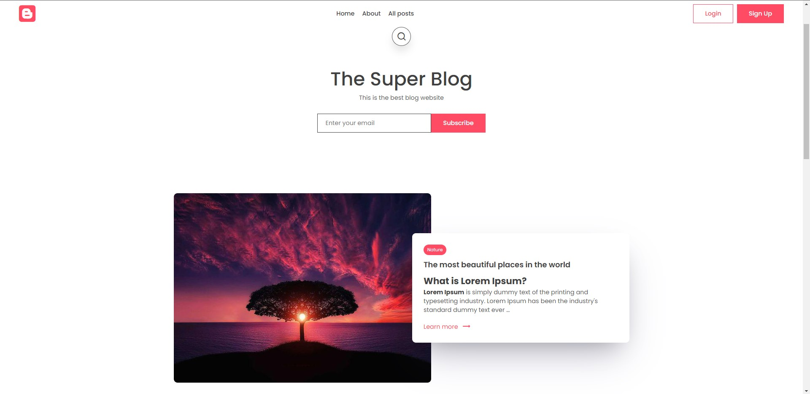

# [blog-website](https://lively-lake-1797.fly.dev/)

### Description:
This is my first Django web application. You can check this project live by [this](https://lively-lake-1797.fly.dev/) link. On this page, you will be able to find the expected functionality from a simple blog website, such as posts with images, comments with replies, likes, an authentication system, and bookmarks. You can check the website by yourself, or go below for screenshots.

### Remark:
This project is part of the course I took. The whole frontend was provided by the author of the course as downloadable files, and half of the backend was written line by line with the author for better understanding.

## Technologies
This project backend is written in `Python` using `Django` library. Static files are maintained by the `Amazon S3` service, project hosted by [fly.io](https://fly.io/).

# Project presentation
On screenshot below you can see main page, which contains header, search button, subscribe form and post, that marked as featured, so it showing as first.

After that there is two lists of posts.

If you click on a post, you will taken to the post page, which shown below.

On the same page a little lower is comments section.

You are also can edit or create posts. On screenshot below, you can see editing page, that is similar to creating new post page.

